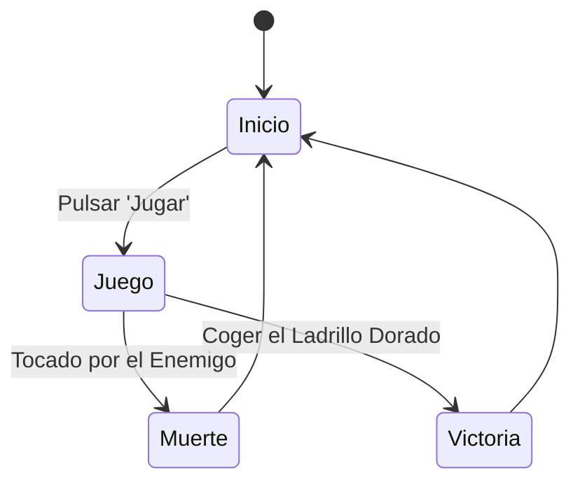

# IAV - Base para la Práctica 1

## Autores
- Javier Villegas Montelongo ([Yavi123](https://github.com/Yavi123))
- Gonzalo Fernández Moreno ([GonzaloFdezMoreno](https://github.com/GonzaloFdezMoreno))
- Enrique Juan Gamboa ([ivo_hr](https://github.com/ivo-hr))

## Propuesta
Este proyecto es una práctica de la asignatura de Inteligencia Artificial para Videojuegos del Grado en Desarrollo de Videojuegos de la UCM, cuyo enunciado original es este: [Historias de fantasmas](https://github.com/Narratech/IAV-Decision).

La practica consiste en desarrollar un prototipo de IA para Videojuegos, dentro de un entorno virtual que represente la ópera de París, con un agente inteligente (el fantasma) que decide, se mueve y actúa según lo que encuentra en sus diferentes estancias, otros agentes más simples como la cantante y el público, y un avatar, el vizconde -némesis del fantasma-, controlado por el jugador.

## Punto de partida
Se parte de un proyecto base de Unity 2021 proporcionado por el profesor y disponible en este repositorio: [IAV-Decision](https://github.com/Narratech/IAV-Decision).

Consiste en un fantasma con un behaviour tree bastante complejo con las clases vacias, el publico con un script sencillo para saber cuando la lampara correspondiente se ha caido y cuando se vuelve a encender, un jugador con los controles basicos utilizando el nav mesh agent y se controla con el teclado, y por ultimo una cantante con una maquina de estados sencilla en la que puede estar cantando, descansando en las bambalinas o secuestrada por el fantasma.

## Diseño de la solución

Lo que vamos a realizar para resolver esta práctica es...

El pseudocódigo del algoritmo de llegada utilizado es:
```
class Arrive:
    character: Kinematic
    target: Kinematic

    maxAcceleration: float
    maxSpeed: float

    # The radius for arriving at the target.
    targetRadius: float

    # The radius for beginning to slow down.
    slowRadius: float

    # The time over which to achieve target speed.
    timeToTarget: float = 0.1

    function getSteering() -> SteeringOutput:
        result = new SteeringOutput()

        # Get the direction to the target.
        direction = target.position - character.position
        distance = direction.length()

        # Check if we are there, return no steering.
        if distance < targetRadius:
            return null

        # If we are outside the slowRadius, then move at max speed.
        if distance > slowRadius:
            targetSpeed = maxSpeed
        # Otherwise calculate a scaled speed.
        else:
            targetSpeed = maxSpeed * distance / slowRadius

        # The target velocity combines speed and direction.
         targetVelocity = direction
        targetVelocity.normalize()
        targetVelocity *= targetSpeed

        # Acceleration tries to get to the target velocity.
        result.linear = targetVelocity - character.velocity
        result.linear /= timeToTarget

        # Check if the acceleration is too fast.
        if result.linear.length() > maxAcceleration:
            result.linear.normalize()
            result.linear *= maxAcceleration

        result.angular = 0
        return result
```

El pseudocódigo del algoritmo de movimiento de huida es...

También es posible mostrar diagramas...


Mejor que insertando imágenes, se puede usar Mermaid:



Para dibujar espacios de coordenadas 2D con puntos y vectores, se podría incrustar una imagen de Google Draw, o intentar incrustarlo en el repositorio también con Mermaid. 

## Pruebas y métricas

Plan de pruebas dividido por características (C1, C2 y C3 serían las 3 pruebas que se han realizado de la característica C)
- [Vídeo con la batería de pruebas](https://youtu.be/xxxxx)

## Ampliaciones

Se han realizado las siguientes ampliaciones

- Los obstáculos del escenario se colocan...

## Producción

Las tareas se han realizado y el esfuerzo ha sido repartido entre los autores. Esto se podrá documentar en una tabla como esta o usando la [pestaña de Proyectos](https://github.com/orgs/Narratech/projects/4/views/1) de GitHub.

| Estado  |  Tarea  |  Fecha  |  
|:-:|:--|:-:|
| ✔ | Diseño: Primer borrador | 2-12-2022 |
| ✔ | Característica A: Nosequé | 11-12-2022 |
| ✔ | Característica B: Nosecuentos| 12-12-2022 |
|   | ... | |
|  | OPCIONAL |  |
| ✔ | Generador pseudoaleatorio | 3-12-2022 |
| :x: | Menú | 3-12-2022 |
| :x: | HUD | 12-12-2022 |

## Referencias

Los recursos de terceros utilizados son de uso público.

- *AI for Games*, Ian Millington.
- [Kaykit Medieval Builder Pack](https://kaylousberg.itch.io/kaykit-medieval-builder-pack)
- [Kaykit Dungeon](https://kaylousberg.itch.io/kaykit-dungeon)
- [Kaykit Animations](https://kaylousberg.itch.io/kaykit-animations)
