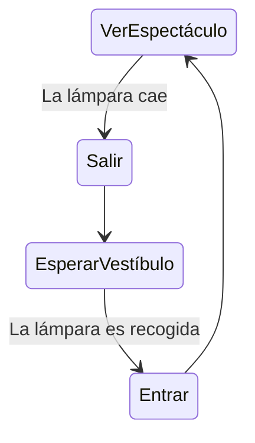
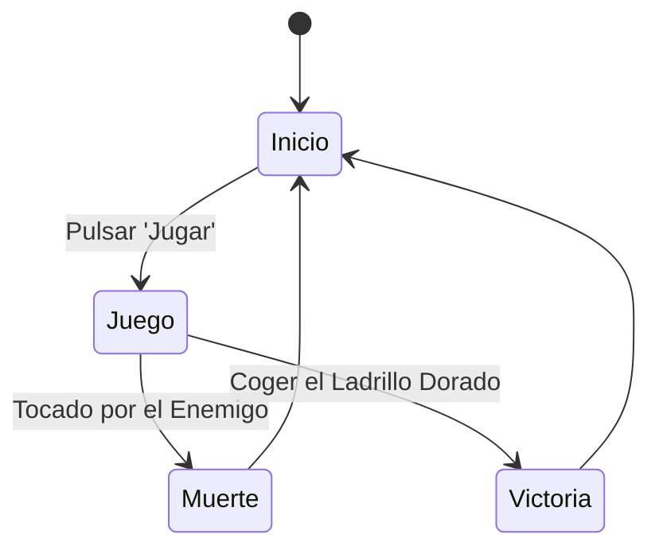

# IAV - Base para la Práctica 1

## Autores
- Javier Villegas Montelongo ([Yavi123](https://github.com/Yavi123))
- Gonzalo Fernández Moreno ([GonzaloFdezMoreno](https://github.com/GonzaloFdezMoreno))
- Enrique Juan Gamboa ([ivo_hr](https://github.com/ivo-hr))

## Propuesta
Este proyecto es una práctica de la asignatura de Inteligencia Artificial para Videojuegos del Grado en Desarrollo de Videojuegos de la UCM, cuyo enunciado original es este: [Historias de fantasmas](https://github.com/Narratech/IAV-Decision).

La practica consiste en desarrollar un prototipo de IA para Videojuegos, dentro de un entorno virtual que represente la ópera de París, con un agente inteligente (el fantasma) que decide, se mueve y actúa según lo que encuentra en sus diferentes estancias, otros agentes más simples como la cantante y el público, y un avatar, el vizconde -némesis del fantasma-, controlado por el jugador.

## Punto de partida
Se parte de un proyecto base de Unity 2021 proporcionado por el profesor y disponible en este repositorio: [IAV-Decision](https://github.com/Narratech/IAV-Decision).

Consiste en un fantasma con un behaviour tree bastante complejo con las clases vacias, el publico con un script sencillo para saber cuando la lampara correspondiente se ha caido y cuando se vuelve a encender, un jugador con los controles basicos utilizando el nav mesh agent y se controla con el teclado, y por ultimo una cantante con una maquina de estados sencilla en la que puede estar cantando, descansando en las bambalinas o secuestrada por el fantasma.

El mapa tiene las siguientes zonas:
- Patio de butacas
- Vestibulo
- Escenario
- Bambalinas
- Palco Oeste
- Palco Este
- Sotano Oeste
- Sotano Este
- Celda
- Sotano Norte
- Sala de Musica

## Diseño de la solución

Lo que vamos a realizar para resolver esta práctica es completar todos los scripts que hay en el proyecto sin completar, como el comportamiento del público para que huya cuand cae la lámpara correspondiente, y vuelva cuando la lámpara se encienda.

También habrá que completar los scripts que utiliza el árbol de comportamiento del fantasma para que tenga el comportamiento pedido

Mejor que insertando imágenes, se puede usar Mermaid:

Público:

Para dibujar espacios de coordenadas 2D con puntos y vectores, se podría incrustar una imagen de Google Draw, o intentar incrustarlo en el repositorio también con Mermaid. 

## Pruebas y métricas

Ni una de momento.

## Ampliaciones

Se han realizado las siguientes ampliaciones

- Los obstáculos del escenario se colocan...

## Producción

Las tareas se han realizado y el esfuerzo ha sido repartido entre los autores. Esto se podrá documentar en una tabla como esta o usando la [pestaña de Proyectos](https://github.com/orgs/Narratech/projects/4/views/1) de GitHub.

| Estado  |  Tarea  |  Fecha  |  
|:-:|:--|:-:|
| ✔ | Diseño: Primer borrador | 23-03-2023 |
| :x: | Característica A: Mundo virtual, movimiento e interaccion con entorno | ... |
| :x: | Característica B: Logica del público| ... |
| :x: | Característica C: Maquina de estados cantante| ... |
| :x: | Característica D: Arbol de comportamiento fantasma| ... |
| :x: | Característica E: Sistema gestion sensorial fantasma| ... |
|  | OPCIONAL |  |
| :x: | Escenario complejo, portales | ... |
| :x: | Escenario mecanismos complejos | ... |
| :x: | Fantasma mas inteligente | ... |
| :x: | Mejor gestion sensorial | ... |
| :x: | Más personajes | ... |

## Referencias

Los recursos de terceros utilizados son de uso público.

- *AI for Games*, Ian Millington.
- [Kaykit Medieval Builder Pack](https://kaylousberg.itch.io/kaykit-medieval-builder-pack)
- [Kaykit Dungeon](https://kaylousberg.itch.io/kaykit-dungeon)
- [Kaykit Animations](https://kaylousberg.itch.io/kaykit-animations)
